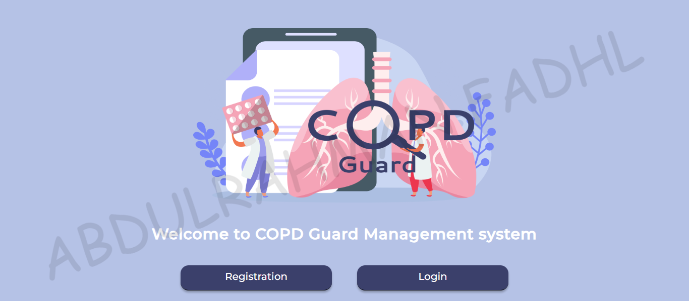
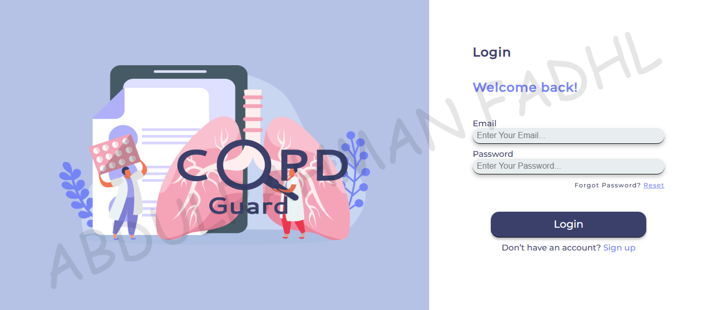
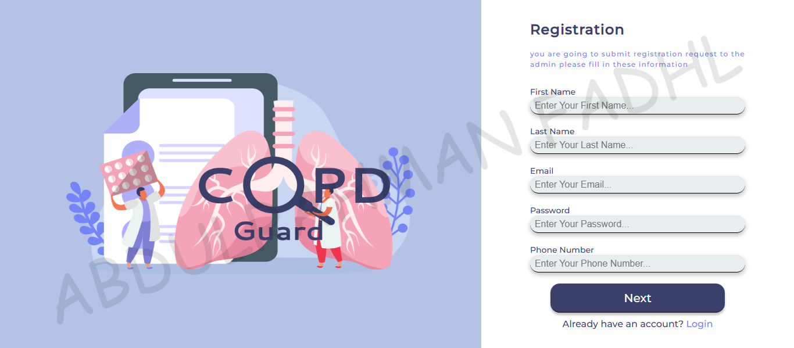
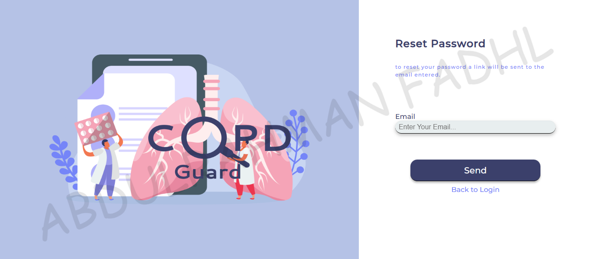
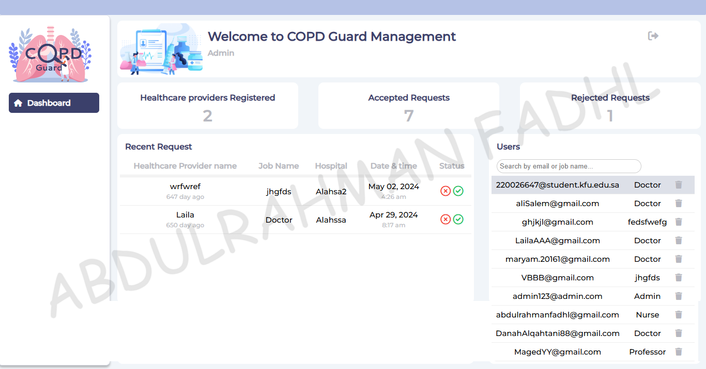
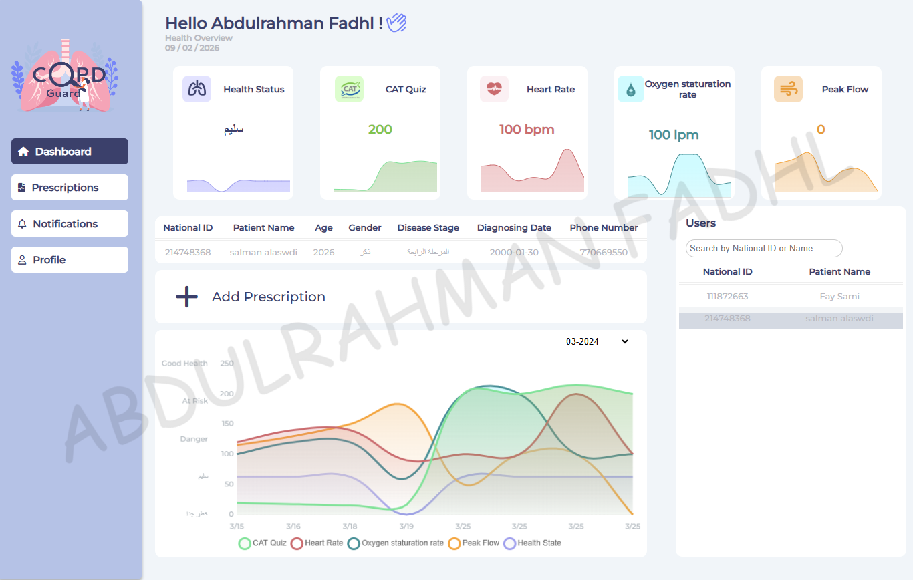
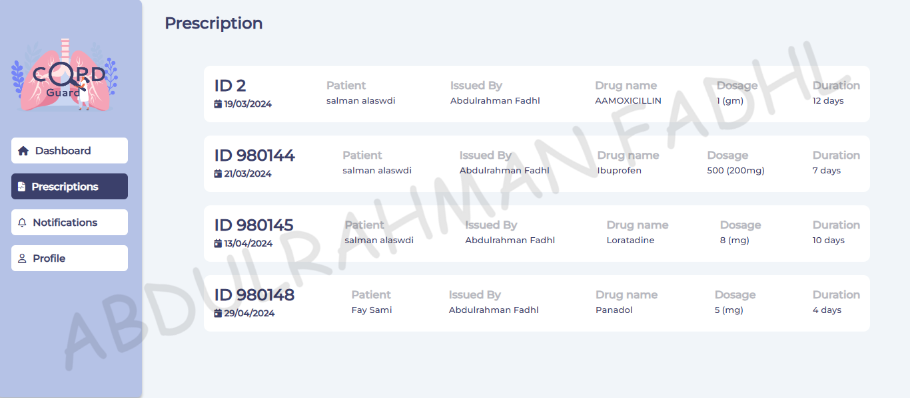
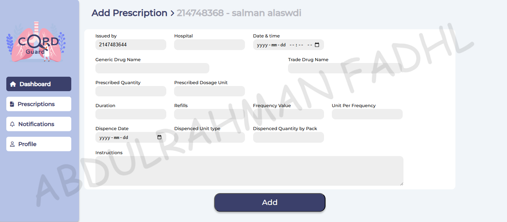
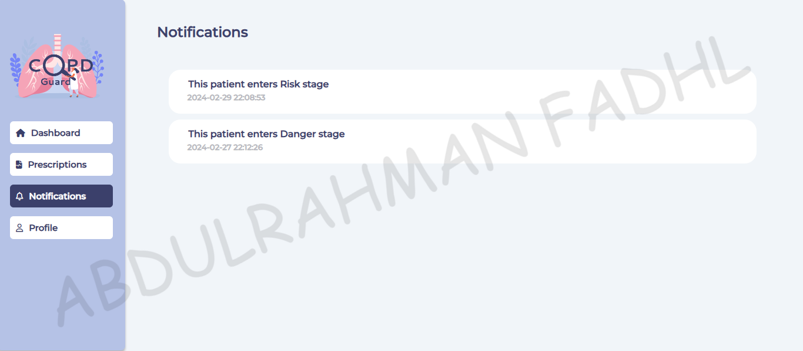
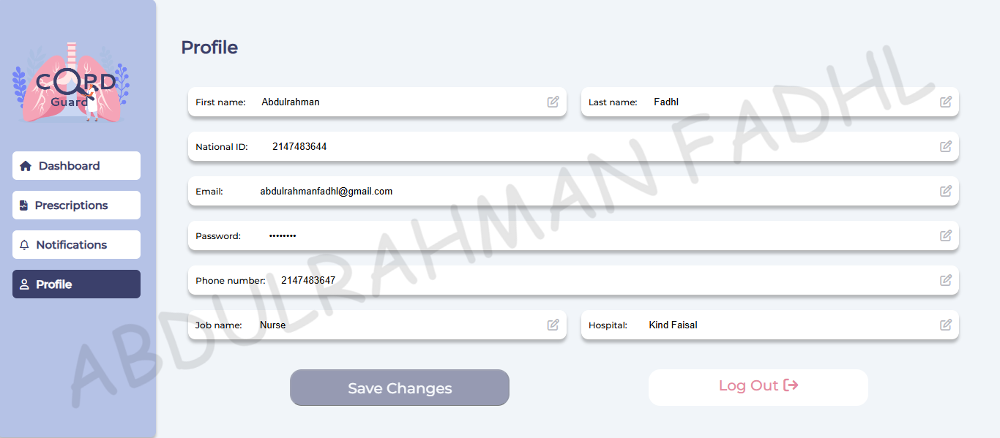

# 🩺 COPD GUARD - Health Management System (Dashboard) | نظام لإدارة ومراقبة مرض الإنسداد الرئوي (لوحة تحكم) 


A web-based health management system designed to assist Healthcare Providers in monitoring and managing patients with Chronic Obstructive Pulmonary Disease (COPD). It facilitates prescription management, health tracking, and communication between patients and providers.


---

## Table of Contents

- 📊 [ Overview](#overview)
- 🚀 [ Key Features](#key-features)
- 🛠️ [ Tech Stack Used](#tech-stack-used)
- 🗂 [ Project Structure](#project-structure)
- 🖥️ [ Project Requirements](#project-requirements)
- ⚡ [ Quick Installation](#quick-installation)
- 🔧 [ Configuration](#configuration)
- 🗄 [ Database Setup](#database-setup)
- ▶️ [ Usage](#usage)
- 📸 [ Screenshots](#screenshots)
- 🤝 [ Contributing](#contributing)
- 📄 [ License](#license)
- 🏷️ [ Credits](#credits)
- 📞 [ Support and Assistance](#support-and-assistance)

---

<h2 id="overview">📊 Overview</h2>

**COPD GUARD** is a comprehensive platform that bridges the gap between patients and healthcare providers. It provides:

- **Real-time Health Tracking** for vital signs like Oxygen Saturation, Heart Rate, and Peak Flow.
- **Data Visualization** using interactive charts to monitor patient progress over time, and visualization of key health metrics like heart rate, oxygen saturation, and peak flow.
- **Prescription Management** for healthcare providers to assign medications directly.
- **Risk Assessment** algorithms to alerting providers of critical patient conditions.

The system is designed with a user-friendly interface for both administrators and healthcare providers.

---

<h2 id="key-features">🚀 Key Features</h2>

### ✔️ Authentication

- **Secure Login** — Different access levels for Admins and Healthcare Providers.
- **Registration** — New Healthcare Providers can request access.
- **Registration Confirmation** — visual confirmation mechanism for successful registrations.
- **Password Reset** — Facility for users to reset forgotten passwords.
- **Session Management** — Secure session handling for authenticated users.

### ✔️ Admin Dashboard (`AdminDashboard.php`)
- **User Management** — View and manage all registered users (Admins & Health Providers).
- **Request Handling** — Approve or reject registration requests from new providers.
- **System Statistics** — Overview of totally user counts and system activity.

### ✔️ Health Provider Dashboard (`HPDashboard.php`)
- **Patient Management** — View assigned patients and access their profiles.
- **Health Monitoring** — Track daily/monthly health records including CAT scores.
- **Visual Analytics** — Charts for Heart Rate, Oxygen Saturation, and Peak Flow trends.
- **Notifications** — Real-time alerts for patients in "At Risk" or "Danger" states.

---

<h2 id="tech-stack-used">🛠️ Tech-Stack Used</h2>

 
 
 
 


---

<h2 id="project-structure">🗂 Project Structure</h2>

```
📁 copd-guard/
├── Index.php            # Landing page & Main entry point
├── Login.php            # User login page
├── Logout.php           # Session logout script
├── Registration.php     # User registration page
├── RegConfirm.php       # Registration confirmation page
├── ResetPass.php        # Password reset request page
├── ResetConfirm.php     # Password reset confirmation
├── Reseted.php          # Password reset success page
├── AdminDashboard.php   # Dashboard for Administrators
├── HPDashboard.php      # Dashboard for Health Providers
├── HealthStatus.php     # Health status tracking page
├── AddPrescription.php  # Page to add new prescriptions
├── Prescriptions.php    # View prescriptions page
├── Notifications.php    # System notifications
├── Profile.php          # User profile management
├── Controller.php       # Core application logic
├── dbcon.php            # Database connection settings
├── utils.php            # Helper functions
├── mail.php             # Email sending utility
├── 📁 css/              # Stylesheets (all.min.css, framework.css, master.css)
├── 📁 js/               # JavaScript files
├── 📁 imgs/             # Images & Icons
├── 📁 webfonts/         # Font resources
├── 📁 database/         # Database files
│   └── copd_guard.sql   # Database schema import file
├── 📁 PHPMailer/        # Email library
├── 📁 docs/             # Documentation files and screenshots
└── README.md            # Project documentation
```

---

<h2 id="project-requirements">🖥️ Project Requirements</h2>

- **Operating System:** Windows 10+, macOS, or any Linux distro  
- **Web Browser:** Chrome / Firefox / Edge (latest versions)  
- **📋Runtime & Tools:**  
  - ***PHP*** 7.4 or higher (8.x recommended)
  - ***MySQL*** 5.7+ or ***MariaDB*** 10.4+
  - ***Apache*** (or compatible web server)
  - ***XAMPP*** (or similar local stack)

---

<h2 id="quick-installation">⚡ Quick Installation</h2>

1. **Clone the Repository** 
     ```bash
     git clone <repository-url>
     cd copd-guard
     ```

2. **Copy the Project into your web server directory**
   ```
   c:\xampp\htdocs\copd-guard\
   ```

3. **Start XAMPP** and ensure Apache and MySQL are running.

4. **Import the database** (see [Database Setup](#database-setup)).

5. **Configure** `dbcon.php` with your database credentials (see [Configuration](#configuration)).

6. **Access the application** in your browser:
   ```
   http://localhost/copd-guard/
   ```

---

<h2 id="configuration">🔧 Configuration</h2>

### Database Connection (`dbcon.php`)

Edit `dbcon.php` to match your local environment credentials:

```php
$servername = "localhost";
$username = "root";
$password = ""; // Default XAMPP password is empty
$dbname = "copd_guard";
```

| Parameter | Description |
|-----------|-------------|
| Host | `localhost` |
| Username | `root` |
| Password | `""` |
| Database | `copd_guard` |

---

<h2 id="database-setup">🗄 Database Setup</h2>

1. Open **phpMyAdmin** or MySQL CLI.

2. Import the schema file:
   ```sql
   -- Run the contents of database/copd_guard.sql
   ```

3. **Key Tables:**
   - **`admins`**: System administrators.
   - **`healthcare_provider`**: Doctors/Providers info.
   - **`patient`**: Patient records and details.
   - **`patient_health_records`**: Vital signs tracking.
   - **`notifications`**: Alerts for risk status.

---

<h2 id="usage">▶️ Usage</h2>

### Default Credentials (for testing)

- **Administrator**:
  - Email: `admin123@admin.com`
  - Password: `admin123`

- **Healthcare Provider**:
  - Email: `abdulrahmanfadhl@gmail.com`
  - Password: `af1212af`

### Workflow
1. **Login** using the credentials above.
2. **Admins** can accept new provider requests from the dashboard.
3. **Providers** can select a patient to view their detailed health charts and add prescriptions.

---

<h2 id="screenshots">📸 Screenshots</h2>

<details>
  <summary>Landing Page</summary>


</details>

<details>
  <summary>Login and Register Page</summary>




</details>

<details>
  <summary>Admin Dashboard Page</summary>


</details>

<details>
  <summary>Healthcare Provider Pages</summary>






</details>

[See All Screenshots...](/docs/screenshots/)

---

<h2 id="contributing">🤝 Contributing</h2>

1. Fork the repository
2. Create a feature branch (`git checkout -b feature/amazing-feature`)
3. Commit your changes (`git commit -m 'Add some amazing feature'`)
4. Push to the branch (`git push origin feature/amazing-feature`)
5. Open a Pull Request

---

<h2 id="license">📄 License</h2>

This project is licensed under the MIT License - see the [LICENSE](LICENSE) file for details.

---

<h2 id="credits">🏷️ Credits</h2>

- **Chart.js** — [chartjs.org](https://www.chartjs.org/)
- **Font Awesome** — [fontawesome.com](https://fontawesome.com)
- **Google Fonts** — [fonts.google.com](https://fonts.google.com/)

---

<h2 id="support-and-assistance">📞 Support and Assistance</h2>

### Getting Help
- **README.md**: For basic instructions
- **GitHub Issues**: Create an issue in the repository

### Contact Information
- **Developer**: Abdulrahman Fadhl Ameer Saif `@EngAboodSDev`
- **Email**: abdulrahmanfadhl@gmail.com
- **LinkedIn**: [Abdulrahman Fadhl](https://www.linkedin.com/in/engaboodsdev/)
- **Repository**: [GitHub Repository](https://github.com/EngAboodSDev/aoun)

---